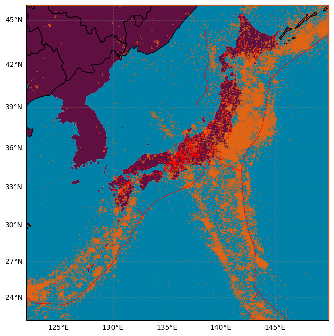
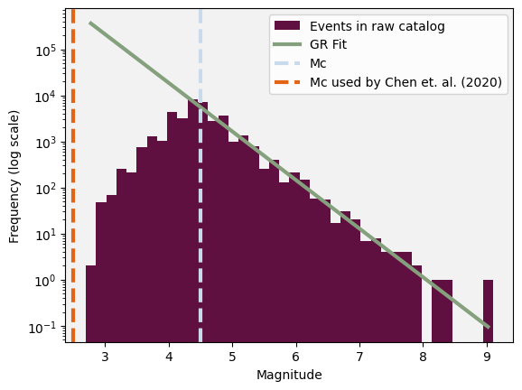
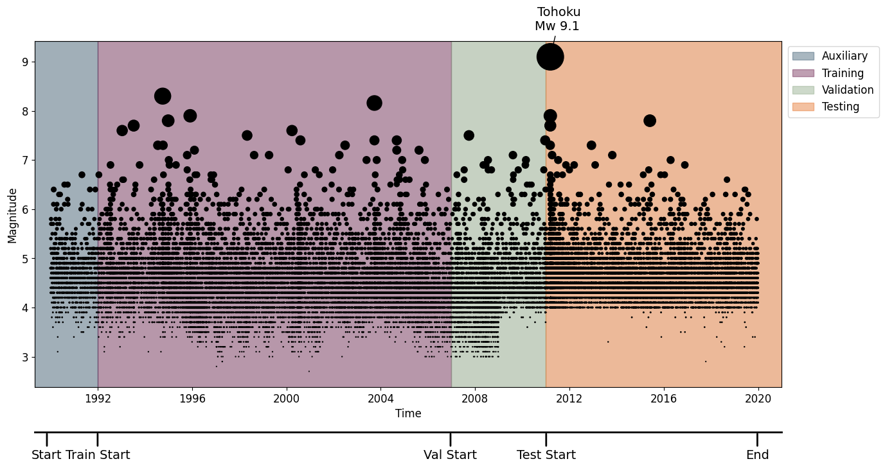

# U.S. Geological Survey Global Catalog of Japan (as used by [1])

[1] introduced an earthquake dataset for benchmarking the Neural Spatio-temporal Point Process (NSTPP) model using a global dataset from the U.S. Geological Survey (USGS), focusing on Japan from 1990 to 2020. They considered earthquakes with magnitudes above 2.5, splitting the data into month-long segments with a 7-day offset. They exclude earthquakes from November 2010 to December 2011, deeming these sequences "too long" and "outliers." However, this period includes the 2011 Tohoku earthquake [2], the largest earthquake recorded in Japan and the fourth largest in the world, at magnitude 9.0. This exclusion renders the benchmarking experiment irrelevant for seismologists, as it is precisely these large earthquakes and their aftershocks that are crucial to forecast due to their damaging impact. Additionally, these events are of significant scientific interest because they provide valuable insights into the earthquake rupture process.

Their dataset segments are divided for training, testing, and validation. Instead of a chronological partitioning that mirrors operational forecasting, the segments are assigned in an alternating pattern. This approach misrepresents a realistic forecasting scenario and inflates performance measures due to earthquake triggering [3]. Since the model is tested on windows immediately preceding training windows, it exploits causal dependencies backwards it time.

We revist this dataset to benchmark ETAS against the three NPPs that have also used the dataset. However, we do not omit the 2011 Tohoku earthquake sequence and we split training-testing data in a chronological order. Although, their chosen magnitude threshold results in an exposure of the models to incomplete data, we keep it identical to theirs to mantain a sufficient number of events.

A future version of EarthquakeNPP will contain extensive experiments on Japan. For more comprehensive benchmarking of models on the region, we will include data from the High Sensitivity Seismograph Network of the National
Research Institute for Earth Science and Disaster Resilience
(NIED) [4], including their high-resolution catalog (JUICE) [5] as well as the the Japan Meterological Agency (JMA) earthquake catalog [6]. These datasets represent what is used current operational earthquake forecasting in Japan [7].

## Downloading the dataset

We begin by importing the neccessary dependencies


```python
import pandas as pd
import numpy as np
import urllib.request
import shutil
import os
import matplotlib.pyplot as plt
from datetime import datetime, timedelta
from dateutil.relativedelta import relativedelta
import math
from scipy.ndimage import uniform_filter1d
import geopandas as gpd
import cartopy.crs as ccrs
import cartopy.feature as cfeature
from shapely.geometry import Polygon
import warnings
warnings.filterwarnings('ignore')
import sys
sys.path.append('..')
from plot_utils import download_USGS_in_windows, combine_csv_files, maxc, azimuthal_equidistant_projection
from scipy.stats import linregress

# Custom Colormap
colors = ["#5F0F40", "#C9DAEA", "#84A07C", "#E36414", "#39A9DB", "#0081A7", "#284B63", "#FFD449"]
```

We can now specify the identical parameters to [1].


```python
# Download Parameters
start_year, start_month = 1990, 1 
end_year, end_month = 2019, 12
window_size_months = 12
max_lat, min_lat, max_lon, min_lon = 46, 22, 150, 122
minimum_magnitude = 1.0
```


```python
# Download data in specified windows
filenames = download_USGS_in_windows(start_year, start_month, end_year, end_month, window_size_months, max_lat, min_lat, max_lon, min_lon, minimum_magnitude)
# filenames = [os.path.join('raw', f) for f in os.listdir('raw')]
combine_csv_files(filenames,'raw/1990_2019.csv')
```

We can now read the combined catalog.


```python
raw_catalog = pd.read_csv("raw/1990_2019.csv")
raw_catalog['time'] = pd.to_datetime(raw_catalog['time']).dt.tz_convert(None)
raw_catalog = raw_catalog.sort_values(by='time')
raw_catalog.rename(columns={'mag': 'magnitude'}, inplace=True)
raw_catalog = raw_catalog[["time", "longitude", "latitude","magnitude"]].dropna()
raw_catalog.reset_index(drop=False, inplace=True)
raw_catalog.rename(columns={'index': 'id'}, inplace=True)
print('the raw catalog has', len(raw_catalog),'events')
```

    the raw catalog has 37581 events


```python
raw_catalog.rename(columns={'mag': 'magnitude'}, inplace=True)
raw_catalog = raw_catalog[["time", "longitude", "latitude","magnitude"]].dropna()
raw_catalog.reset_index(drop=False, inplace=True)
raw_catalog.rename(columns={'index': 'id'}, inplace=True)
```

## Visualising the Catalog

Let's plot events in the raw catalog over time along with an estimate of the completeness using Maximum Curvature [6]. We can see that a value of 4.5 is fairly constant over the catalog. Another feauture we observe is a sudden ommission of most events below magnitude 4.0 following 2009. This global catalog by the USGS is primarily concerned with Mw 4.5 or larger events and is therefore a deliberate ommission rather than a lack of small earthquakes during that time.


```python
%matplotlib inline
plt.figure(figsize=(15, 7))
plt.gca().set_facecolor((0.95, 0.95, 0.95))

# Compute M_c(t) across the raw catalog
window_size=300
nwindows = math.floor(len(raw_catalog['magnitude'])/window_size)

Mc_t = [0]*nwindows
mid_time = [0]*nwindows

comp_T = raw_catalog['time']
comp_M = raw_catalog['magnitude']

for i in range(nwindows):
    
    mid_time[i] =  pd.Timestamp(pd.Series(comp_T[i*window_size:(i+1)*window_size]).mean())

    window = comp_M[i*window_size:(i+1)*window_size]
    Mc_t[i] = maxc(window,0.05)

# Smooth M_c(t) for plotting
Mc_t = uniform_filter1d(Mc_t, size=40)

# Plotting
plt.step(mid_time,Mc_t,colors[0],label=r'$M_c(t)$',lw=3)
z = (3.5**raw_catalog['magnitude'])*0.01
plt.scatter(raw_catalog['time'],raw_catalog['magnitude'],s=z,color =colors[3])
plt.xlabel('Time',fontsize=12)
plt.ylabel('Magnitude',fontsize=12)
plt.xticks(fontsize=12)
plt.yticks(fontsize=12)
plt.legend(fontsize=12)
plt.show()
```


    

    


Let's now visualise the coordinates of the events in the catalog


```python
# Read the GEM fault data
gdf = gpd.read_file('/home/ss15859/Downloads/gem_active_faults.gpkg')
faults = gdf.geometry

# Filter the GeoDataFrame to include only geometries within the specified extent
filtered_gdf = gdf.cx[min_lon:max_lon, min_lat:max_lat]

# Extract the geometry of the faults within the specified extent
faults_within_extent = filtered_gdf.geometry


# Create a figure with Cartopy
fig = plt.figure(figsize=(10.5, 8.1))

ax = fig.add_subplot(1, 1, 1, projection=ccrs.Mercator())
ax.set_extent([122, 150, 22, 46], crs=ccrs.PlateCarree())

# Add colored land and ocean
ax.add_feature(cfeature.LAND, facecolor="#5F0F40")
ax.add_feature(cfeature.OCEAN, facecolor="#0081A7")
ax.add_feature(cfeature.STATES, edgecolor='black')


# Plot the faults
for geom in faults_within_extent:
    ax.plot(geom.xy[0], geom.xy[1], color='red', transform=ccrs.PlateCarree(),zorder=10,linewidth=0.7)


# Add gridlines with customization
gl = ax.gridlines(draw_labels=True, color='gray', linestyle='--', alpha=0.4)
gl.right_labels = False
gl.top_labels = False
ax.tick_params(axis='x', labelsize=16)
ax.tick_params(axis='y', labelsize=16)


# Plot polygon
polygon_coords = np.load('Japan_shape.npy')
plot_polygon_coords = np.append(polygon_coords, [polygon_coords[0]], axis=0)
ax.plot(plot_polygon_coords[:, 1], plot_polygon_coords[:, 0], transform=ccrs.PlateCarree(), color=colors[3], lw=2)

# Plot events
ax.scatter(raw_catalog['longitude'], raw_catalog['latitude'], transform=ccrs.PlateCarree(), s=0.4, color=colors[3], alpha=0.8)
plt.show()
```


    

    


## Truncating the Catalog

Following [1], we keep all the events in the region and do not truncate in time.


```python
## filter events within polygon
poly = Polygon(polygon_coords)
gdf = gpd.GeoDataFrame(
    raw_catalog,
    geometry=gpd.points_from_xy(
        raw_catalog.latitude, raw_catalog.longitude),)

catalog = gdf[gdf.intersects(poly)].copy()
catalog.drop("geometry", axis=1, inplace=True)
len_trunc_x = len(catalog)
print('Removed',len(raw_catalog)-len_trunc_x, 'events outside polygon')

# filter events within timewindow
auxiliary_start = '1990-01-01 00:00:00'
test_nll_end = '2020-01-01 00:00:00'
catalog = catalog[catalog['time']>=auxiliary_start]
catalog = catalog[catalog['time']<test_nll_end]
len_trunc_t = len(catalog)
print('Removed',len_trunc_x-len_trunc_t, 'events outside timewindow')
```

    Removed 0 events outside polygon
    Removed 0 events outside timewindow


We consider events from 1971 onwards, due to the improvements of the network from this period. However, the events for the training log-likelihood won't begin until 1981. If we plot the magnitude-frequency histogram of this earlier period of the improved network, we can see that it is complete for earthquakes above Mw 2.5.


```python
# plotting params
plt.figure()
plt.gca().set_facecolor((0.95, 0.95, 0.95))
bins = 40
linew = 3

# histogram
hist, bins = np.histogram(catalog['magnitude'], bins=bins)
log_hist = np.log10(hist[hist > 0])
bin_centers = (bins[:-1] + bins[1:]) / 2
bin_centers = bin_centers[hist > 0]

plt.hist(catalog['magnitude'], bins=bins, log=True, alpha=1, color=colors[0], label='Events in raw catalog')
plt.xlabel(r'Magnitude')
plt.ylabel('Frequency (log scale)')

# Fit a GR line to the log-transformed histogram data
mag_bin = 0.05
mask = (bin_centers >= 4.5) & (bin_centers<=7)
slope, intercept, r_value, p_value, std_err = linregress(bin_centers[mask], log_hist[mask])
plt.plot(bin_centers, 10**(slope * bin_centers + intercept), 'r-',color = colors[2], label='GR Fit',linewidth=linew)
plt.axvline(x=4.5, color=colors[1], linestyle='--', label='Mc',linewidth=linew)
plt.axvline(x=2.5, color=colors[3], linestyle='--', label='Mc used by Chen et. al. (2020)',linewidth=linew)

plt.legend()
plt.show()
```


    

    


The deviation of the magnitude frequency histogram from the Gutenberg-Richter law suggests that the magnitude of completeness is around 4.5. Keeping all events above 2.5, as in [1], exposes the models to incomplete data.

Setting the threshold at 2.5 will not remove any events.


```python
# filter events above magnitude threshold
Mcut = 2.5
catalog = catalog[catalog['magnitude']>=Mcut]
len_trunc_m = len(catalog)
print('Removed',len_trunc_t-len_trunc_m, 'events below Mcut')
```

    Removed 0 events below Mcut


## Choosing training-testing splits

Let's now plot the truncated catalog, including the training, validation and testing windows. For the splits, we choose to begin testing at start of the 2011 in order to test forecasts during the Tohoku earthquake sequence.


```python
import matplotlib.pyplot as plt
import pandas as pd

# time windows for training, validation, and testing
auxiliary_start = pd.Timestamp('1990-01-01 00:00:00')
training_start = pd.Timestamp('1992-01-01 00:00:00')
validation_start = pd.Timestamp('2007-01-01 00:00:00')
testing_start = pd.Timestamp('2011-01-01 00:00:00')
testing_end = pd.Timestamp('2020-01-01 00:00:00')

# Plotting
fig, ax = plt.subplots(figsize=(15, 7))
ax.set_facecolor((0.95, 0.95, 0.95))

# Plotting earthquakes
z = (3.5**raw_catalog['magnitude'])*0.01
scatter = ax.scatter(catalog['time'], catalog['magnitude'], s=z, color='black')

xmin, xmax = pd.Timestamp('1989-05-01'), pd.Timestamp('2021-01-01')
ax.set_xlim(xmin, xmax)

# Highlighting time windows
alph = 0.4
ax.axvspan(xmin, training_start, color=colors[6], alpha=alph, label='Auxiliary', zorder=-100)
ax.axvspan(training_start, validation_start, color=colors[0], alpha=alph, label='Training', zorder=-100)
ax.axvspan(validation_start, testing_start, color=colors[2], alpha=alph, label='Validation', zorder=-100)
ax.axvspan(testing_start, xmax, color=colors[3], alpha=alph, label='Testing', zorder=-100)

trans = ax.get_xaxis_transform()
lineheight, textheight = -.13, -.18

# Annotations for train/val/test windows
annotations = [
    ('Start', 7250),
    ('Train Start', 8035),
    ('Val Start', 13499),
    ('Test Start', 14980),
    ('End', 18250),
]

for label, x_pos in annotations:
    ax.annotate(
        label, xy=(x_pos, lineheight), xycoords=trans, ha="center", va="top", fontsize=14,
        xytext=(x_pos, textheight), textcoords=trans, arrowprops=dict(arrowstyle='-', color='black', lw=2)
    )

ax.plot([xmin, xmax], [lineheight, lineheight], color="k", transform=trans, clip_on=False, lw=2)

# Event annotations
events = [
    ('2011-03-11', 'Tohoku', 'North Coast', '9.1'),
]

for date, name, location, magnitude in events:
    event_date = pd.Timestamp(date)
    magnitude = float(magnitude)
    ax.annotate(
        f'{name}\nMw {magnitude} ',
        xy=(event_date, magnitude),
        xytext=(10, 30),
        textcoords='offset points',
        arrowprops=dict(facecolor='black', arrowstyle='->'),
        fontsize=14,
        ha='center'
    )

# Labels and formatting
ax.set_xlabel('Time', fontsize=12)
ax.set_ylabel('Magnitude', fontsize=12)
ax.tick_params(axis='x', labelsize=12)
ax.tick_params(axis='y', labelsize=12)
ax.legend(loc='upper left', bbox_to_anchor=(1.001, 1), fontsize=12)

plt.show()
```


    

    


Finally, since ETAS uses the great-circle distance between two points on a sphere (km), for the NPPs we need to project the coordinates of the events into a space such that inter-event distances are in km. To do this, we can use the Azimuthal equidistant projection [7], which preserves distances from all points to a center point.

We pass the mean coordinates of the catalog as the center coordinates of the projection.


```python
center_latitude = catalog['latitude'].mean()  # Latitude of the center point
center_longitude = catalog['longitude'].mean()  # Longitude of the center point

# Convert latitude and longitude to Cartesian coordinates using Plate Carrée projection
catalog['x'], catalog['y'] = azimuthal_equidistant_projection(catalog['latitude'], catalog['longitude'], center_latitude, center_longitude)
```

Finally, we can write this pre-processed catalog to file.


```python
catalog.to_csv("Japan_catalog.csv", index=False)
```

## References

[1]: Chen, R. T., Amos, B., & Nickel, M. (2020). Neural spatio-temporal point processes. arXiv preprint arXiv:2011.04583.

[2]: Mori, N., Takahashi, T., Yasuda, T., & Yanagisawa, H. (2011). Survey of 2011 Tohoku earthquake tsunami inundation and run‐up. Geophysical research letters, 38(7).

[3]: Freed, A. M. (2005). Earthquake triggering by static, dynamic, and postseismic stress transfer. Annu. Rev. Earth Planet. Sci., 33, 335-367.

[4]: High Sensitivity Seismograph Network Laboratory, Network Center for Earthquake, Tsunami and Volcano,
National Research Institute for Earth Science and Disaster Resilience. https://www.hinet.bosai.go.jp/

[5]: Yano, T. E., Takeda, T., Matsubara, M., & Shiomi, K. (2017). Japan unified high-resolution relocated catalog for earthquakes (JUICE): crustal seismicity beneath the Japanese Islands. Tectonophysics, 702, 19-28.

[6]: Tamaribuchi, K. (2018). Evaluation of automatic hypocenter determination in the JMA unified catalog. Earth, Planets and Space, 70, 1-10.

[7]: Omi, T., Ogata, Y., Shiomi, K., Enescu, B., Sawazaki, K., & Aihara, K. (2019). Implementation of a real‐time system for automatic aftershock forecasting in Japan. Seismological Research Letters, 90(1), 242-250.

[8]: Wiemer, S., & Wyss, M. (2000). Minimum magnitude of completeness in earthquake catalogs: Examples from Alaska, the western United States, and Japan. Bulletin of the Seismological Society of America, 90(4), 859-869.

[9]: Bradley, A. D. (1945). Azimuthal Equidistant Projection of the Sphere. The American Mathematical Monthly, 52(3), 148-151.
